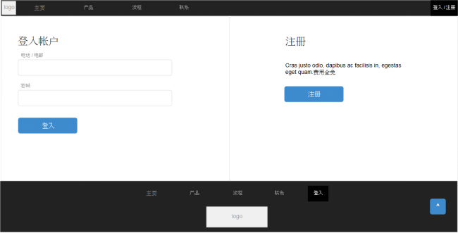

<!-- toc -->
#1.1.登入界面


##1.1.1.登入
Request: GET /users/login
```
{
	“login”: “tester”, (用户名/电话)
	“password”: “12346”
}
```
Response:
```

{
	“token": “fesrglkthtgrtgktlttthy”
}

ParameterException(“Invalid user name or password.”)  - 400, 用户名/电话/电邮/密码不对
UserAccountException(“User account suspended.”)  - 401, 帐户已被暂停
UserAccountException(“User account terminated.”)  - 401, 帐户已被删除
```