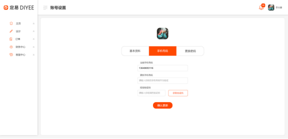

#1.4.帐户设置界面 – 手机号码




##1.4.1.更新手机
```
Request: PUT /users/mobile
{
	“mobile”: “13172008872”,
	“smsVerificationCode”: “321123”
}

Response:
{
	“result”:”ok”
}

ParameterException(“Invalid mobile number.”)  - 400, 手机号码无效
ParameterException(“Mobile number already existed.”)  - 400, 手机号码已被使用
ParameterException(“Invalid SMS verification code.”)  - 400, 短信认证码错误或过期（十分钟）
```


