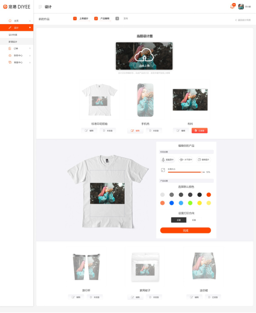

#3.2.设计产品界面




#3.2.1.设计产品选项列表
```
Request: GET /designs/{id}/product-designer

Response:
{
"result": [ {
		“productId": 123
		“productId": 123
		“categoryName": “标准印花T恤”,
		“productImageM": “/3/123m_yii4586.jpg”,
		“productImageL": “/3/123l_445fiuh.jpg”,
“canvasWidth”: “6000px”,
“canvasHeight”: “8000px”,
“canvasMinWidth”: “1500px”, 
“canvasMinHeight”: “2000px”,
“canvasScreenWidth”:”600px”,
“canvasScreenHeight”:”800px”,
“canvasScreenOffsetX”:”50px”,
“canvasScreenOffsetY”:”60px”,
“designFileWidth”: “6000px”,
“designFileHeight”: “8000px”,
“customizations”:{
“resizedImageL”: “/5/315l_45khh89.jpg”,
“imagePositionX”: “0px”,
“imagePositionY”: “0px”,
“imageScaleX”: “1”,
“imageScaleY”: “1”,
“imageRepeatTypeId”:”1”
}
	} ]
}

ParameterException(“Design not found”)  - 400, 设计不存在


```
