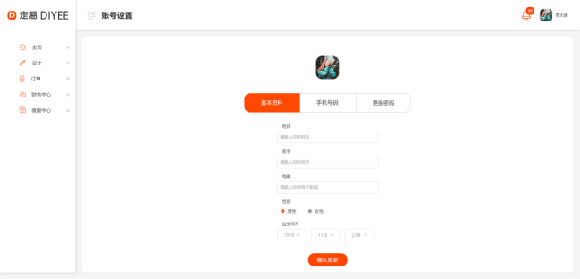

#1.3.帐户设置界面 – 基本资料



##1.3.1.更新基本资料
```
Request: PUT /users
{
	“surname”: “test test”,
	“givenName”: “test test”,
	“email”: “test test”,
	“gender”: 1,
	“birthday”: “1988-08-08”
}

Response:
{
	“result”:”ok”
}

ParameterException(“Email not in correct format.”)  - 400, 电邮地址格式错误

```
