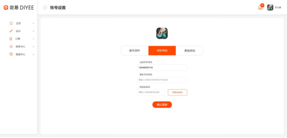

#1.5.帐户设置界面 – 更新密码


##1.5.1.更新密码
```

Request: PUT /users/password
{
	“oldPassword”: “123456”,
	“newPassword”: “654321”
}

Response:
{
	“result”:”ok”
}

ParameterException(“Incorrect existing password.”)  - 400, 现有密码错误
ParameterException(“Password must be at least 6 character long and contains both letter and number.”)  - 400, 密码长度必须为6位以上及同时包含数字和非数字字符

```

