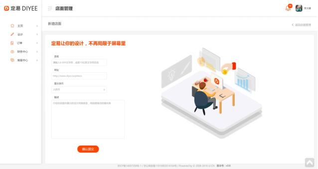

#2.1.新增店面界面



##2.1.1.查询店户名重复
```
Request: GET /shops/name-check
{
	“shopName”: “test name”
}

Response:
{
	“exist": false
}
```

##2.1.2.查询店URL重复
```
Request: GET /shops /url-check
{
	“shopUrlPath”: “shishishop”
}

Response:
{
	“exist": true
}
```


##2.1.3.开店
```
Request: POST /shops
{
	“shopName”: “试试店”,
	“shopUrlPath”: “shishishop”, 
	“currencyId”: 1, (1 for RMB)
	“description”: “test test test test…”
}

Response:
{
	…shop 物件属性
}

ParameterException(“Shop name already existed.”)  - 400, 店名已被使用
ParameterException(“Shop URL already existed.”)  - 400, 店铺网址已被使用

```


