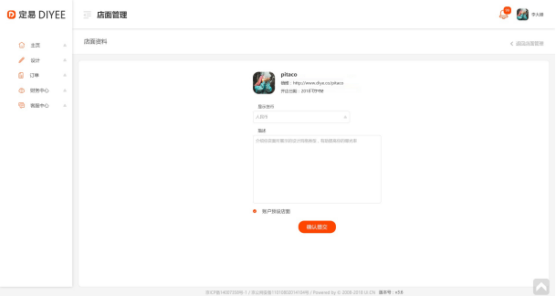

#2.2.更新店面界面



##2.2.1.取得店面属性
```

Request: GET /shops/{id}

Response:
{
	…shop 物件属性
}

ResourceNotFoundException(“Shop record not found.”)  - 404, 找不到店面记录

```


##2.2.2.更新店面设定

```
Request: PUT /shops/{id}
{
	“currencyId”: 1, (1 for RMB)
	“description”: “test test test test…”
“isDefault”: true
}

Response:
{
	…shop 物件属性
}

ResourceNotFoundException(“Shop record not found.”)  - 404, 找不到店面记录
AuthorizationException(“User not authorized to update shop ID - 12345.”)  - 401, 用户没有权限更改此店铺
```
