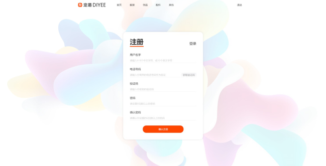

#1.2.注册界面


##1.2.1.查询用户名重复

```
Request: Get /users/name-check
{
	“username”: “peter”
}

Response:
{
	“exist": true
}
```

##1.2.2.请求短信认证码
```
Request: POST /users/sms-verification
{
	“mobile”: “13172008872”
}

Response:
{
	“sent": true
}

ParameterException(“Mobile number already existed.”)  - 400, 手机号码已被使用
ParameterException(“Invalid mobile number.”)  - 400, 手机号码无效
SMSException(“SMS cannot be sent.”)  - 500, 无法发出短信
```

##1.2.3.用户注册
```
Request: POST /users
{
	“username”: “peter”,
	“mobile”: “13172008872”,
	“smsVerificationCode”: “12321”,
	“password”: “dy201817”
}

Response:
{
	“token": “sjhkrsgkhsdk4565hjy6jh”
}

ParameterException(“Username must be at least 2 charactres long and contains at least one non-numeric character.”)  - 400, 用户名长度不得少于2字及必须包含最少一个非数字字符
ParameterException(“Username already existed.”)  - 400, 用户名已被使用
ParameterException(“Invalid mobile number.”)  - 400, 手机号码无效
ParameterException(“Mobile number already existed.”)  - 400, 手机号码已被使用
ParameterException(“Invalid SMS verification code.”)  - 400, 短信认证码错误或过期（十分钟）
ParameterException(“Password must be at least 6 character long and contains both letter and number.”)  - 400, 密码长度必须为6位以上及同时包含数字和非数字字符
```