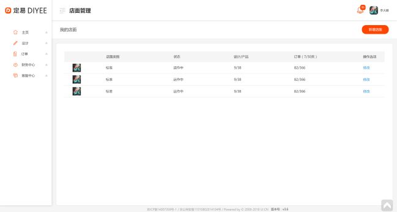

#2.3.店面列表



## 2.3.1.帐户店面列表
```
Request: GET /shops?offset=5&limit=10

Response:
{
"result": [ {
		“id”:12345,
		“shopName”:”teststore”,
		“shopStatusName”:”正常”,
		“designCount”:”9/38”,
“orderCount”:”82/366”
	} ],
"paging": {
        "total": 3,       表项目总数
        "offset": 5,      跳过项目数
        "limit": 10       限制项目数
 }
}

```
