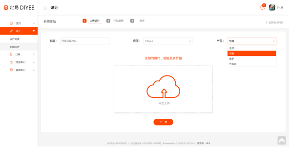

#3.1.上载设计界面



##3.1.1.店面选项列表
```
Request: GET /shops/select-list

Response:
{
"result": [ {
		“id”:12345,
		“shopName”:”teststore”
	}… ],
}
```


##3.1.2.原产品类别选项列表
```
Request: GET /categories/select-list?endnode=true

Response:
{
"result": [ {
		“id”:12345,
		“categoryName”:”T 恤”
	} … ],
}
```


##3.1.3.上传设计图
```
Request: POST /files
{
		“designId”: 3699
}
Response:
{
		“upload_token”: “redtgkhdfgkfdjg454t5T”
}

Request: POST file to 供应商
Response:
{
		“externalfileId”:12345,
“sourceImage”: ”65hyty.jpg”,

		“resizedImageL”:”8ghjgh.jpg”,
 	“resizedImageM”:”ht63jg5.jpg”,
“resizedImageS”:”43jhg5.jpg”
}
```


##3.1.4.提交到下一步

```
Request: POST /designs
{
		“title”:”什么什么设计”,
 	“fileId”:12345,
		“file”:[{
			“externalfileId”:12345,
“sourceImage”: ”65hyty.jpg”,
		“resizedImageL”:”hfjkh867.jpg”,
 	“resizedImageM”:”ht63jg5.jpg”,
“resizedImageS”:”43jhg5.jpg”
}]
}

	Response:
{
		…design 物件
}

```

